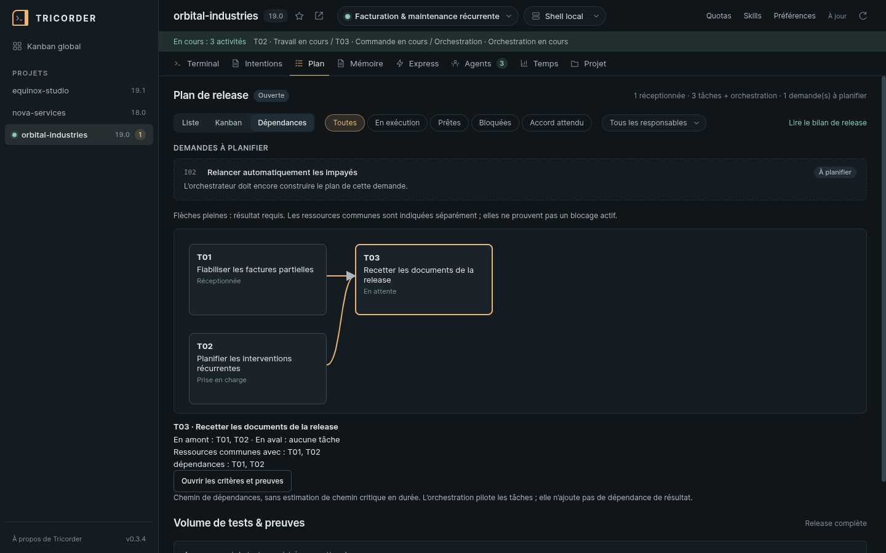
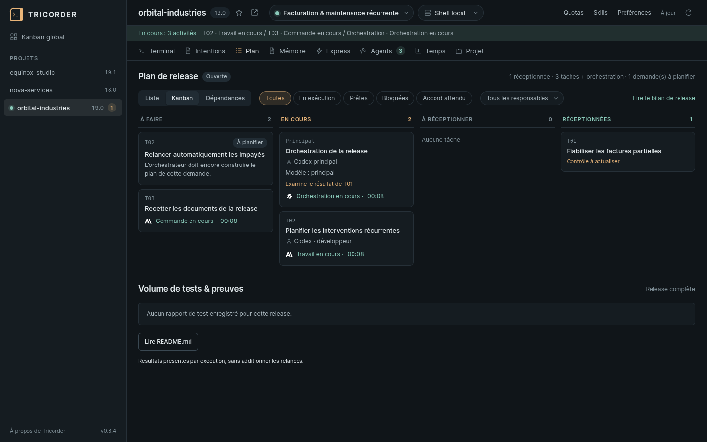
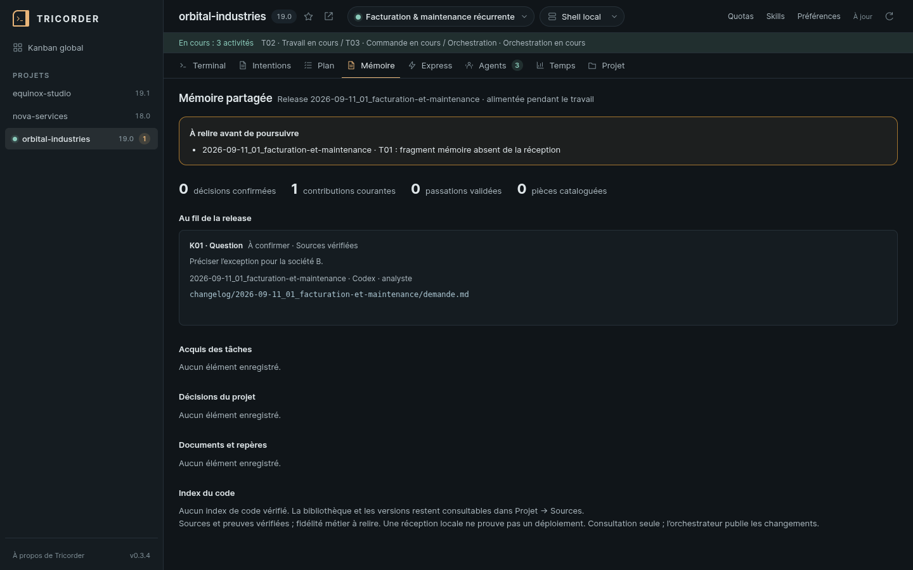
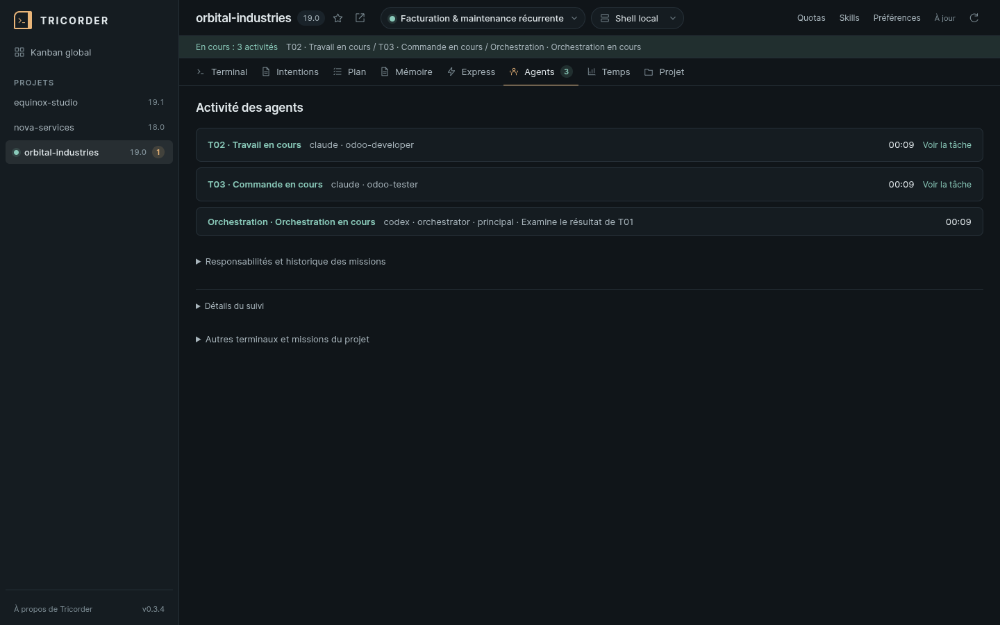

# Odoo Tricorder

**Un cockpit de bureau pour suivre vos projets Odoo avec Claude Code et Codex.**

Retrouvez vos demandes, le plan de release, les agents en activité et leurs
résultats autour d’un terminal persistant. **Odoo Crew orchestre le travail ;
Tricorder en montre l’avancement.**

[Installer la version 0.3.4](https://github.com/le-goff-benoit/odoo-tricorder/releases/tag/v0.3.4) ·
[Installer Odoo Crew](https://github.com/le-goff-benoit/odoo-crew/blob/main/docs/INSTALL.md) ·
[Exemples de parcours](docs/WORKFLOWS.md) ·
[Signaler un problème](https://github.com/le-goff-benoit/odoo-tricorder/issues)

## De la demande au résultat

**Intentions → Plan → Exécution → Recette**

- **Intentions** conserve les demandes originales, décisions et questions ouvertes.
- **Plan** présente les tâches, leurs critères et leurs dépendances, en **liste**,
  en **Kanban** ou en **graphe**, avec les mêmes filtres et le même responsable.
- Le Plan et le **Kanban global** montrent aussi les demandes **À planifier**,
  avant leur découpage en tâches, et le travail d’orchestration.
- **Mémoire** montre les découvertes partagées pendant la release, les passations
  des tâches reçues, décisions, questions et pièces sourcées. Les contributions
  apparaissent automatiquement ; une source périmée est signalée.
- **Agents** montre toutes les activités observées : développement, QA, orchestration
  ou attente. Le filtre **En exécution** permet de les retrouver dans les tableaux.
- **Temps & estimations** distingue prévisions, durées enregistrées et mesures manquantes.
  Les fiches de tâche regroupent critères, responsabilités et preuves de contrôle.

Les captures présentent des projets synthétiques.

### Comprendre l’ordre du travail



Le graphe montre les tâches en amont et en aval. Les ressources communes sont
signalées séparément ; la mention **Peut démarrer** vient des règles Crew.
La liste offre les mêmes accès aux tâches au clavier.

### Voir les nouvelles demandes sans attendre le plan



Dès que Crew enregistre une demande, elle apparaît **À planifier** ou **À préciser**.
Quand l’orchestrateur la relie aux tâches retenues, celles-ci remplacent sa carte
provisoire. L’intention et sa source restent consultables. Cette carte n’autorise
aucune exécution à elle seule.

### Partager les acquis pendant la release



Les agents lisent les acquis avant leur tâche et publient leurs découvertes au
fil du travail. La clôture consolide cette mémoire déjà utilisée. Une décision
peut rendre périmées les seules tâches explicitement affectées ; les propositions
restent visibles sans devenir des règles confirmées. [Parcours détaillé](docs/WORKFLOWS.md).

## Lire les preuves de qualité

Les rapports JUnit sont comptés séparément. Un rapport qui mélange des résultats
détaillés et des compteurs incompatibles est signalé comme non exploitable : il
ne peut plus apparaître vert en masquant un échec. Un rapport vert ne suffit pas
à déclarer une tâche reçue.

Le [banc Odoo Crew](https://github.com/le-goff-benoit/odoo-crew/blob/main/docs/quality-lab/README.md)
sépare calibration des tests, exécution native des agents et réception du travail.
Les comparaisons de vitesse restent liées à la qualité réellement vérifiée.

## Installer

Le paquet **0.3.4** cible Linux Ubuntu/Pop!_OS **amd64**. La construction et les
parcours de bureau sont vérifiés sur Pop!_OS 22.04 LTS.

1. Télécharger `odoo-tricorder_0.3.4_amd64.deb` dans la
   [release 0.3.4](https://github.com/le-goff-benoit/odoo-tricorder/releases/tag/v0.3.4).
2. Depuis le dossier contenant le téléchargement :

   ```bash
   sudo apt install ./odoo-tricorder_0.3.4_amd64.deb
   ```

3. Ouvrir **Odoo Tricorder** dans le menu des applications.

Python 3 et les bibliothèques du bureau sont des dépendances du paquet.
Pour le suivi Odoo complet, installer séparément
[Odoo Crew, version actuelle](https://github.com/le-goff-benoit/odoo-crew)
et **Claude Code, Codex, ou les deux**, avec leurs accès habituels.
Odoo Crew doit être généré avec `build.sh`, normalement dans `~/.odoo19-agents`.
Le terminal reste utilisable sans fournisseur IA.

## Commencer

1. Dans **Préférences → Dossiers partagés → Dossier des projets**, choisir la racine
   de vos projets si elle diffère de votre dossier personnel.
2. Choisir un projet à gauche, puis une release ou **Aucune release**.
3. Dans **Terminal**, cliquer sur **Claude** ou **Codex** pour ouvrir un lancement
   avec suivi. Les boutons portent les logos Anthropic et OpenAI. Vous pouvez
   aussi ouvrir un shell avec `Ctrl Shift T`.
4. Dans l’agent lancé, demander le plan puis son exécution avec les skills Crew.
   Le bouton **Skills** prépare la syntaxe à copier ; il n’exécute pas le skill.
5. Suivre les résultats dans **Plan** (liste, Kanban ou dépendances) et **Agents**. Cliquer une tâche
   ouvre ses détails, sans réaffecter le terminal.

Les skills se saisissent **dans la conversation de l’agent**, pas dans le shell :

| Action | Claude Code | Codex |
|---|---|---|
| Construire ou adapter le plan | `/odoo-plan` | `$odoo-plan` |
| Exécuter le périmètre autorisé | `/odoo-start` | `$odoo-start` |
| Faire la recette complète et clôturer | `/odoo-close` | `$odoo-close` |
| Réaliser un correctif local express | `/odoo-express` | `$odoo-express` |
| Diagnostiquer un ticket | `/odoo-support` | `$odoo-support` |

Voir [trois parcours avec demandes prêtes à adapter](docs/WORKFLOWS.md).

## Lire les états et les mesures



| Indication | Ce qu’elle signifie |
|---|---|
| **À planifier / À préciser** | Demande enregistrée, sans tâche exécutable liée. |
| **Prise en charge** | Responsabilité enregistrée ; l’activité effective se lit dans le suivi fournisseur. |
| **Réceptionnée** | Travail reçu dans l’historique de la release. |
| **Contrôle à actualiser** | La réception reste conservée, mais les preuves demandent un nouveau contrôle dans ce contexte. |
| **En exécution** | Activité confirmée par une observation récente. Un terminal ouvert ne suffit pas. |
| **Durée inconnue / Suivi à vérifier** | Il manque une borne fiable ou une observation récente. Cela ne prouve pas l’arrêt du processus. |

Le timer indique le **temps écoulé de l’étape observée**, pas un pourcentage de
progression. Les temps communs d’orchestration ne sont pas ajoutés une seconde fois
aux tâches. Un relevé partiel ne produit pas de faux gain par rapport à une prévision complète.

Les modifications des demandes et plans sont détectées toutes les **2 secondes**,
puis les données sont relues. Le suivi fournisseur est interrogé toutes les
**5 secondes** ; une actualisation générale intervient toutes les **30 secondes**.
Le bouton Actualiser reste disponible.

### Quotas et automatisation : disponibilité actuelle

- Les indicateurs de compte prévoient les fenêtres **5 h / hebdomadaire** et leurs
  remises à zéro. **Les quotas natifs réels n’ont pas pu être qualifiés lors de la
  livraison 0.3.1** : les adaptateurs sont expérimentaux. Tant qu’aucune donnée
  fiable n’existe, la barre supérieure n’affiche qu’un lien **Quotas** vers le
  détail ; les pastilles par fournisseur apparaissent dès qu’une fenêtre est lue.
  Aucun appel modèle ne sert à les rafraîchir.
- L’orchestrateur conserve le **modèle principal**. Les modèles plus légers par rôle
  restent expérimentaux dans Crew ; aucun basculement automatique ne dépend du quota.
- Les hooks transmettent les événements et peuvent rappeler au principal la suite
  autorisée. **Ils ne réveillent pas un agent principal dont la session est fermée**
  et ne valent pas réception d’une tâche. Le retour natif dépend du fournisseur et
  de son transport ; les permissions et interruptions restent respectées.

## Navigation et raccourcis

L’onglet **Projet** donne accès aux **Fichiers**, **Environnements** et **Sources**.
Les préférences règlent notamment le terminal et le contraste.
L’environnement choisi est un repère ; il ne crée pas de connexion Odoo ni de
permission d’écriture.

| Raccourci | Action |
|---|---|
| `Ctrl Shift T` | Nouveau terminal |
| `Ctrl Shift F` | Rechercher dans le terminal |
| `Ctrl Shift C` / `Ctrl Shift V` | Copier la sélection du terminal / coller |
| `Ctrl Alt ↑` / `Ctrl Alt ↓` | Projet précédent / suivant |
| `Ctrl PageUp` / `Ctrl PageDown` | Terminal précédent / suivant |
| `Alt 1` à `Alt 8` | Onglets dans l’ordre affiché : Terminal, Intentions, Plan, Mémoire, Express, Agents, Temps, Projet |
| `Ctrl Shift P` | Palette de skills |
| `Ctrl Alt F` | Recherche dans les documents des projets |

La barre supérieure réunit le nom du projet, sa série, la release consultée
(pastille avec l’état de la release) et l’environnement des nouveaux terminaux.
La bande **En cours** n’apparaît que lorsqu’une activité est confirmée ou qu’une
décision est attendue ; l’onglet **Agents** porte alors le compte. Le raccourci
vers l’installation d’Odoo Crew n’est affiché que si le dispositif est absent du poste.

## Données locales et persistance

Tricorder lit les projets, plans, preuves et workflows sans les modifier.
Les agents et commandes lancés dans le shell conservent leurs propres permissions.
Fermer la fenêtre laisse les terminaux en marche ; ils ne survivent pas au
redémarrage du poste. Changer de vue ne change ni leur dossier ni leurs instructions.

L’application utilise Electron, xterm.js et un service Python sur socket Unix privée.
Elle n’expose aucun service TCP, n’envoie aucune télémétrie et ne lit ni le trousseau
ni les clés des fournisseurs. Les lancements suivis conservent des métadonnées
locales d’événements ; ils ne parcourent pas globalement vos conversations.
Les préférences sont dans `~/.config/odoo-tricorder/settings.json` par défaut.

## Développer et vérifier

Node.js 22+, Python 3.10+ et Odoo Crew pour les tests d’intégration :

```bash
npm ci
npm test
npm run test:ui
npm run dist
npm run test:packaged
npm run checksum
```

`npm start` lance l’application depuis les sources. Les tests utilisent des projets
temporaires synthétiques ; les parcours Electron nécessitent une session graphique
ou `xvfb-run -a`. Les tests ordinaires ne lancent aucune campagne de modèles réelle.

## Licence et marques

Code sous [licence MIT](LICENSE). Les logos OpenAI et Anthropic sont des marques
de leurs titulaires ; leurs [sources officielles sont documentées](assets/providers/README.md).
Projet indépendant, sans affiliation à Odoo, OpenAI, Anthropic ou Star Trek.
