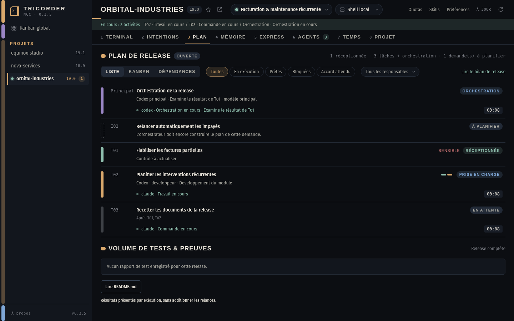
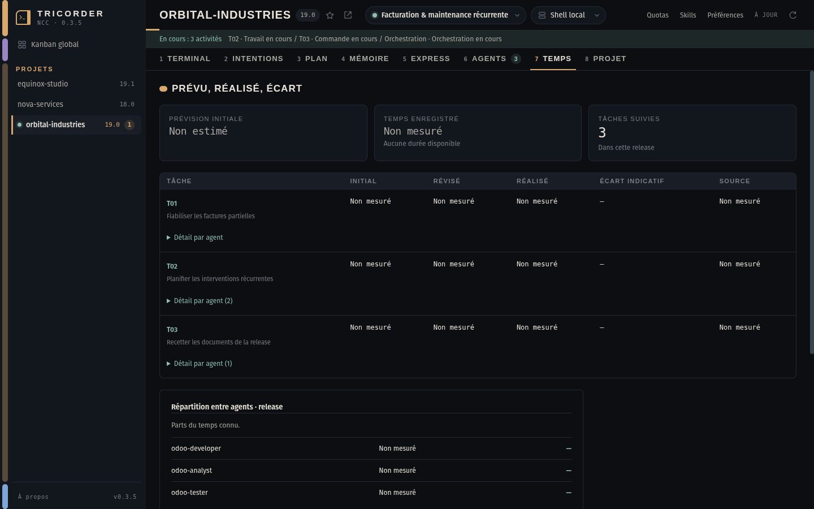

# Odoo Tricorder

**Le cockpit de bureau de vos projets Odoo menés avec Claude Code et Codex.**

Un terminal persistant par projet, et autour de lui tout ce qu’il faut pour
garder la main sur l’exécution : les demandes d’origine, le plan de la release,
les agents en activité, leurs preuves et leur temps. **Odoo Crew orchestre le
travail ; Tricorder le rend lisible.** Rien n’est modifié depuis le cockpit.

[Installer la version 0.3.5](https://github.com/le-goff-benoit/odoo-tricorder/releases/tag/v0.3.5) ·
[Installer Odoo Crew](https://github.com/le-goff-benoit/odoo-crew/blob/main/docs/INSTALL.md) ·
[Parcours d’exemple](docs/WORKFLOWS.md) ·
[Direction visuelle](docs/design/DIRECTION.md) ·
[Signaler un problème](https://github.com/le-goff-benoit/odoo-tricorder/issues)

## Ce que vous voyez

Une release se lit de gauche à droite dans la barre d’onglets, dans l’ordre du
travail : **Intentions → Plan → Mémoire → Express → Agents → Temps**, le tout
adossé au **Terminal**. Chaque onglet porte son numéro : `Alt 1` à `Alt 8`.

### Le plan, en liste, en Kanban ou en graphe



Chaque ligne dit trois choses : identifiant, titre et état ; le responsable ou
l’étape en cours ; l’activité réellement observée avec son minuteur. Le capuchon
coloré à gauche et le **rail d’étapes** (parcourue, en cours, à venir) donnent
l’avancement d’un regard. Les filtres (**En exécution**, **Prêtes**, **Bloquées**,
**Accord attendu**) et le choix du responsable valent pour les trois modes.


Le mode **Dépendances** montre l’amont et l’aval d’une tâche. Les ressources
communes sont signalées séparément ; « peut démarrer » vient des règles Crew.

### Les demandes, avant même leur découpage


Dès que Crew enregistre une demande, elle apparaît **À planifier** ou
**À préciser** dans le Plan et dans le **Kanban global**. Quand l’orchestrateur
la relie aux tâches retenues, celles-ci remplacent sa carte provisoire ;
l’intention et sa source restent consultables dans **Intentions**.

### La mémoire partagée de la release


Les agents publient leurs découvertes, décisions et passations au fil du
travail ; une source périmée ou une contribution à relire est signalée en tête.

### Les agents et leur temps


**Agents** ne montre que ce qui est observé : un terminal ouvert n’est pas une
activité. La bande **En cours** sous l’en-tête et le compteur de l’onglet
n’apparaissent que lorsqu’une activité est confirmée ou qu’une décision est
attendue. **Temps** distingue prévisions, durées enregistrées et mesures
manquantes ; « Non mesuré » ne vaut jamais zéro.



## Installer

Le paquet **0.3.5** cible Linux Ubuntu / Pop!_OS **amd64**. La construction et
les parcours de bureau sont vérifiés sur Pop!_OS 22.04 LTS.

1. Télécharger `odoo-tricorder_0.3.5_amd64.deb` dans la
   [release 0.3.5](https://github.com/le-goff-benoit/odoo-tricorder/releases/tag/v0.3.5).
2. Depuis le dossier du téléchargement :

   ```bash
   sudo apt install ./odoo-tricorder_0.3.5_amd64.deb
   ```

3. Ouvrir **Odoo Tricorder** dans le menu des applications.

Python 3 et les bibliothèques du bureau sont des dépendances du paquet. Pour le
suivi Odoo complet, installer séparément
[Odoo Crew](https://github.com/le-goff-benoit/odoo-crew) (généré avec `build.sh`,
normalement dans `~/.odoo19-agents`) et **Claude Code, Codex, ou les deux**. Le
terminal reste utilisable sans fournisseur IA ; un raccourci vers l’installation
de Crew n’est proposé dans la barre latérale que si le dispositif manque.

## Commencer

1. **Préférences → Dossiers partagés → Dossier des projets** : la racine de vos
   projets si elle diffère de votre dossier personnel.
2. Choisir un projet dans la barre latérale, puis une release dans la pastille de
   l’en-tête (le point vert signale une release ouverte). La seconde pastille est
   l’environnement des nouveaux terminaux : un repère, jamais une connexion ni
   une permission.
3. Dans **Terminal**, cliquer sur **Claude** ou **Codex** pour ouvrir un
   lancement avec suivi ; `Ctrl Shift T` ouvre un shell simple.
4. Dans l’agent, demander le plan puis son exécution avec les skills Crew. Le
   bouton **Skills** prépare la syntaxe à copier ; il n’exécute rien.
5. Suivre dans **Plan** et **Agents**. Cliquer une tâche ouvre sa fiche
   (critères, preuves, temps) sans réaffecter le terminal.

Les skills se saisissent **dans la conversation de l’agent**, pas dans le shell :

| Action | Claude Code | Codex |
|---|---|---|
| Construire ou adapter le plan | `/odoo-plan` | `$odoo-plan` |
| Exécuter le périmètre autorisé | `/odoo-start` | `$odoo-start` |
| Faire la recette complète et clôturer | `/odoo-close` | `$odoo-close` |
| Réaliser un correctif local express | `/odoo-express` | `$odoo-express` |
| Diagnostiquer un ticket | `/odoo-support` | `$odoo-support` |

Trois parcours prêts à adapter : [docs/WORKFLOWS.md](docs/WORKFLOWS.md).

## Lire les états

| Indication | Ce qu’elle signifie |
|---|---|
| **À planifier / À préciser** | Demande enregistrée, sans tâche exécutable liée. |
| **Prise en charge** | Responsabilité enregistrée ; l’activité effective se lit dans le suivi fournisseur. |
| **Réceptionnée** | Travail reçu dans l’historique de la release. |
| **Contrôle à actualiser** | La réception reste conservée, mais les preuves demandent un nouveau contrôle dans ce contexte. |
| **En exécution** | Activité confirmée par une observation récente. Un terminal ouvert ne suffit pas. |
| **Durée inconnue / Suivi à vérifier** | Il manque une borne fiable ou une observation récente. Cela ne prouve pas l’arrêt du processus. |

Le minuteur indique le **temps écoulé de l’étape observée**, pas un pourcentage.
Les rapports JUnit sont comptés par exécution ; un rapport qui mélange des
résultats détaillés et des compteurs incompatibles est signalé comme non
exploitable et ne peut pas apparaître vert. Un rapport vert ne suffit pas à
déclarer une tâche reçue.

Les demandes et plans sont relus dès qu’un fichier change (contrôle toutes les
**2 secondes**) ; le suivi fournisseur est interrogé toutes les **5 secondes** ;
une actualisation générale intervient toutes les **30 secondes**.

### Quotas : disponibilité actuelle

Les adaptateurs de quotas **5 h / hebdomadaire** sont expérimentaux et n’ont pas
pu être qualifiés sur compte réel. Tant qu’aucune donnée fiable n’existe, la
barre supérieure n’affiche qu’un lien **Quotas** ; les pastilles par fournisseur
apparaissent dès qu’une fenêtre est lue. Aucun appel modèle ne sert à les
rafraîchir et aucun basculement de modèle n’en dépend.

## Raccourcis

| Raccourci | Action |
|---|---|
| `Alt 1` à `Alt 8` | Terminal, Intentions, Plan, Mémoire, Express, Agents, Temps, Projet |
| `Ctrl Shift T` | Nouveau terminal |
| `Ctrl Shift F` | Rechercher dans le terminal |
| `Ctrl Shift C` / `Ctrl Shift V` | Copier la sélection du terminal / coller |
| `Ctrl Alt ↑` / `Ctrl Alt ↓` | Projet précédent / suivant |
| `Ctrl PageUp` / `Ctrl PageDown` | Terminal précédent / suivant |
| `Ctrl Shift P` | Palette de skills |
| `Ctrl Alt F` | Recherche dans les documents des projets |

L’onglet **Projet** regroupe les ressources en lecture seule : **Fichiers**,
**Environnements** et **Sources**. Les préférences règlent le terminal, la
largeur de la barre latérale et le contraste.

## Données locales

Tricorder lit les projets, plans, preuves et workflows sans les modifier. Les
agents et commandes lancés dans le shell conservent leurs propres permissions.
Fermer la fenêtre laisse les terminaux en marche ; ils ne survivent pas au
redémarrage du poste. Changer de vue ne change ni leur dossier ni leurs
instructions.

L’application utilise Electron, xterm.js et un service Python sur socket Unix
privée. Elle n’expose aucun service TCP, n’envoie aucune télémétrie, ne charge
rien depuis le réseau (polices comprises) et ne lit ni le trousseau ni les clés
des fournisseurs. Les lancements suivis conservent des métadonnées locales
d’événements ; ils ne parcourent pas vos conversations. Les préférences sont dans
`~/.config/odoo-tricorder/settings.json`.

## Développer et vérifier

Node.js 22+, Python 3.10+ et Odoo Crew pour les tests d’intégration :

```bash
npm ci
npm test            # 87 tests Python, 56 tests Node
npm run test:ui     # 17 parcours Electron sur projets synthétiques
npm run dist        # paquet Debian dans release/
npm run test:packaged
npm run checksum
```

`npm start` lance l’application depuis les sources. Les parcours Electron
nécessitent une session graphique ou `xvfb-run -a`. Aucun test ne lance de
campagne de modèles réelle. Le socle visuel est documenté dans
[docs/DESIGN.md](docs/DESIGN.md) ; les maquettes des directions explorées sont
dans [docs/design/variants](docs/design/variants).

## Licence et marques

Code sous [licence MIT](LICENSE). Les polices Antonio et IBM Plex sont embarquées
sous [SIL Open Font License](assets/fonts/README.md). Les logos OpenAI et Anthropic
sont des marques de leurs titulaires ; leurs
[sources officielles sont documentées](assets/providers/README.md). L’identité
visuelle est un hommage discret aux interfaces LCARS de *Star Trek : The Next
Generation*. Projet indépendant, sans affiliation à Odoo, OpenAI, Anthropic ou
Paramount.
