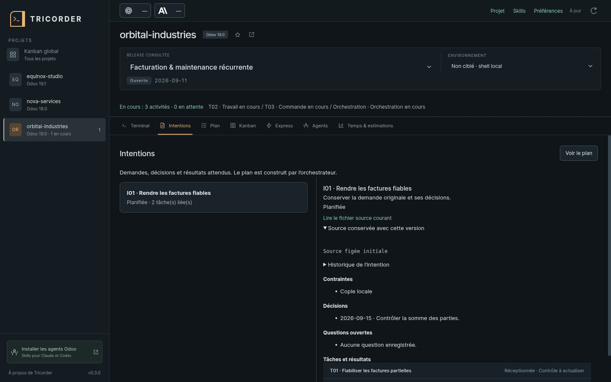

# Trois parcours avec Odoo Tricorder

[Revenir au guide d’installation](../README.md)

Ces exemples utilisent des demandes fictives. Saisissez-les dans **Claude Code**
ou **Codex**, après avoir lancé l’agent depuis le terminal du projet.
Dans Codex, remplacez le préfixe `/` des skills ci-dessous par `$`.
Le bouton **Skills** permet de préparer cette syntaxe à copier dans l’agent.

## 1. Préparer une release, l’exécuter et faire la recette

**Besoin :** améliorer une recherche et un affichage, avec des résultats précis.

Dans Claude Code :

```text
/odoo-plan Prépare une release pour ces deux demandes :
1. Retrouver un équipement par son numéro de série dans la recherche existante.
2. Afficher la date de la prochaine visite sur la fiche équipement.
Conserve mes demandes originales. Vérifie le standard, définis les critères
et les tests avant le développement, puis construis le plan et ses dépendances.
```

Dans Codex, le même début devient `$odoo-plan Prépare une release…`.

Ouvrez **Intentions** : les demandes, leurs sources et les décisions sont lisibles.
Les questions encore ouvertes restent explicites. L’orchestrateur construit ensuite
les tâches et les relie à ces intentions.



Dans **Plan**, consultez les critères d’une tâche et utilisez **Dépendances** pour
comprendre l’ordre retenu. Le graphe distingue les résultats requis des ressources
communes. L’orchestrateur fixe les commandes de contrôle et les responsabilités.

Puis demandez explicitement l’exécution du périmètre voulu :

```text
/odoo-start Exécute toutes les tâches autorisées de cette release.
Enchaîne celles qui sont disponibles et indique la raison d’une attente.
```

La carte **Orchestration de la release** montre le travail du principal.
**Agents** et le filtre **En exécution** montrent les activités observées ensemble.
Une QA peut travailler pendant un développement indépendant si Crew a réservé
des candidats et des ressources compatibles ; l’ouverture de deux terminaux ne
suffit pas à organiser ce parallélisme.

Après les réceptions des tâches :

```text
/odoo-close Fais la recette complète de la release et prépare sa clôture.
```

La recette porte sur le résultat intégré. Le statut clos ne prouve pas un
déploiement en production ; celui-ci garde son autorisation propre.

## 2. Ajouter une demande pendant le travail

**Besoin :** une nouvelle demande arrive alors que la release contient déjà des tâches.

```text
/odoo-plan Ajoute à la release ouverte cette demande : afficher aussi
le contact de maintenance sur la fiche équipement.
Enregistre d’abord l’intention, puis adapte le découpage et les critères.
Conserve les tâches déjà reçues et explique les contrôles réellement impactés.
```

Dès que Crew écrit cette intention, Tricorder détecte la modification et affiche
une carte **À planifier** ou **À préciser** dans le Plan et les deux Kanbans.
Les modifications sont vérifiées toutes les deux secondes, puis le projet est relu.
Le cockpit affiche ce qui a été enregistré ; il ne lit pas les messages de la
conversation pour inventer une demande.


Cliquez la carte pour lire l’intention. Elle n’est pas encore exécutable et ne
compte pas parmi les tâches reçues. L’orchestrateur peut la découper en plusieurs
tâches, compléter une tâche existante, poser une question ou motiver un report.

Quand une tâche réelle est liée à l’intention, sa carte provisoire disparaît au
profit du plan. **La source et l’historique restent dans Intentions.** Si toutes
les tâches liées disparaissent du plan, la demande redevient visible à planifier.
Les intentions reportées ou satisfaites restent consultables dans le registre.

Pour autoriser les nouvelles tâches une fois le plan construit :

```text
/odoo-start Exécute les nouvelles tâches du plan concernant le contact
de maintenance et reprends les contrôles impactés indiqués dans le plan.
```

Consulter une autre tâche ou une autre release ne change pas le contexte du
terminal existant. En cas de doute, revenez au terminal associé au travail en cours.

## 3. Traiter une retouche express ou un ticket de support

### Retouche précise et locale

```text
/odoo-express Remplace le titre « Fiche client » par « Informations client »
sur ce formulaire, sans changer les champs ni leur comportement.
```

Le principal qualifie la retouche, la réalise et effectue ses contrôles ciblés.
La vue **Express** suit cette intervention à l’échelle du projet, même sans
release sélectionnée. Si le besoin dépasse le périmètre express, Crew le redirige
vers le parcours de développement complet.

Ce skill peut se saisir directement dans l’agent, même s’il n’apparaît pas dans
la palette proposée par cette version du cockpit.

### Problème dont la cause reste à établir

```text
/odoo-support Un utilisateur ordinaire ne peut plus confirmer un devis.
Reproduis le problème sur la copie locale, identifie la cause et propose
le contournement ou la suite à donner.
```

Le support distingue usage, configuration, données, bug et évolution. Il apporte
un diagnostic et les preuves utiles. Un correctif éventuel suit ensuite le parcours
approprié ; l’investigation ne suffit pas à déclarer le problème résolu.

Dans les deux cas, les détails de tâche et les documents de projet donnent accès
aux résultats enregistrés. Une activité silencieuse ou une durée absente reste
signalée comme telle : le cockpit n’en déduit ni réussite ni arrêt.
## Une mémoire nourrie pendant la release

1. Dans **Intentions**, l'orchestrateur conserve les demandes et leurs pièces.
2. Il prépare le **Plan** avec critères et dépendances, puis active la mémoire
   partagée Crew. Chaque agent reçoit les acquis avant sa tâche.
3. Pendant le travail, une découverte ou une question publiée apparaît dans
   **Mémoire**. Après réception, le fragment de la tâche devient disponible aux
   suivantes. Les vues se rafraîchissent automatiquement.
4. Une décision nouvelle indique les tâches affectées. Leurs anciennes réceptions
   deviennent périmées ; les acquis indépendants restent valides.
5. La clôture consolide les règles et les questions restantes. Le déploiement
   exige ses propres observations : une tâche reçue localement ne le prouve pas.

Tricorder consulte ces fichiers ; l'orchestrateur Crew publie et arbitre.
Les anciennes releases ne sont pas converties automatiquement en décisions.
[Commandes Crew et formats](https://github.com/le-goff-benoit/odoo-crew/blob/main/docs/KNOWLEDGE.md).
